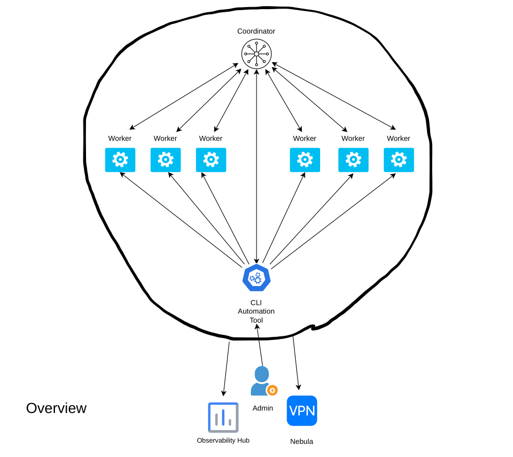
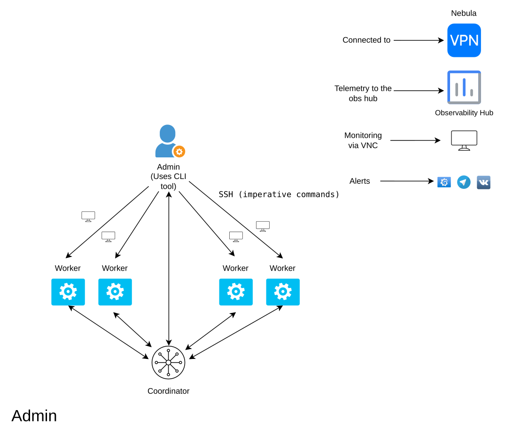
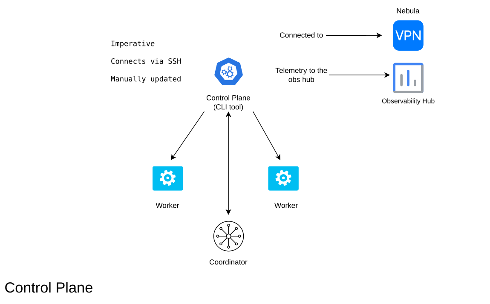
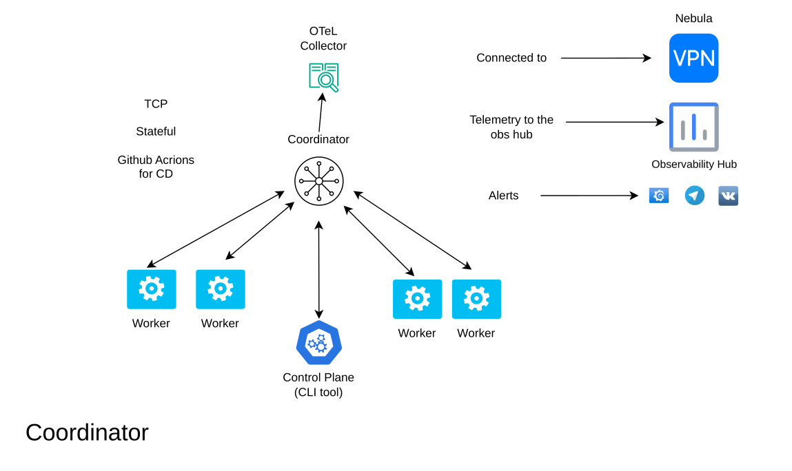
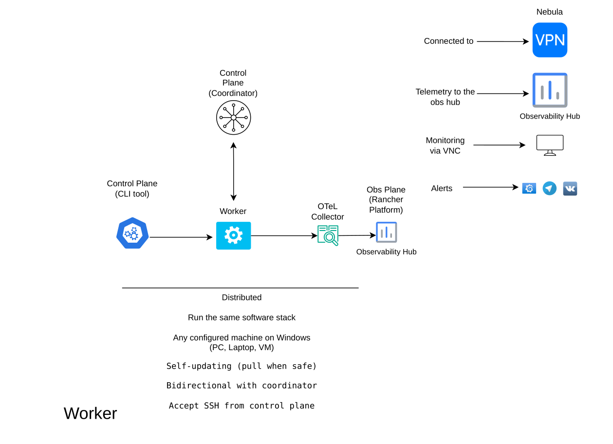
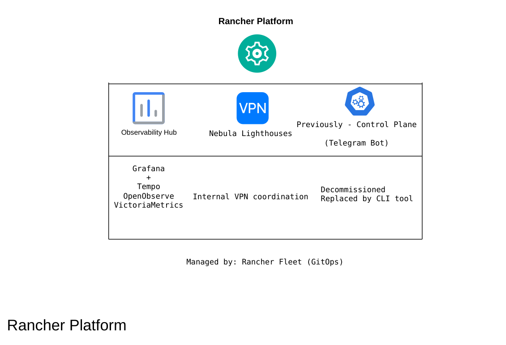
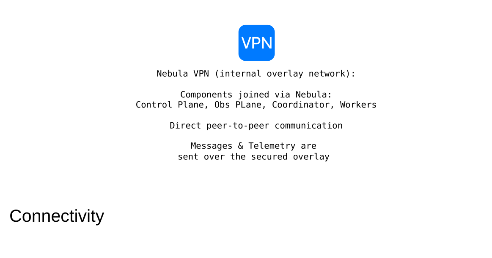

# SkiesGames — System Architecture

Architecture of a production distributed automation platform: **180 workers** worldwide,
a stateful Rust coordinator, an imperative CLI control plane, and a GitOps-managed
observability stack — all on a Nebula VPN mesh.

Built and operated end-to-end (design → deploy → onboard telemetry → on-call).

## Planes

| Plane             | Role                                                                                                                     |
| ----------------- | ------------------------------------------------------------------------------------------------------------------------ |
| **Data**          | 180 workers, same software stack, self-updating (`pull when safe`), bidirectional with the coordinator, SSH from the CLI |
| **Control**       | Rust coordinator (Tokio, custom binary TCP protocol) + imperative CLI for direct worker ops                              |
| **Observability** | HA Kubernetes on Rancher (RKE2): OTel Collectors → VictoriaMetrics, Tempo, OpenObserve → Grafana                         |
| **Networking**    | Nebula overlay — every component joins the mesh; messages & telemetry ride the VPN                                       |

## Diagrams

Editable source: [`diagrams/source/SkiesGames.drawio`](./diagrams/source/SkiesGames.drawio)

### Overview

### Admin

### Control Plane

### Coordinator

### Worker

### Rancher Platform

### Connectivity

## Design trade-offs

**Why a stateful coordinator instead of only a queue?**

Both RabbitMQ and the coordinator are stateful. RabbitMQ is far more complicated and heavier than this app. I wanted something fast, easy, and clear to operate. Scaling further means decoupling the coordinator into two pieces: a cell-pinned profile/statistics service, plus an easy-to-deploy HA database with strong consistency (e.g. MongoDB), queried from any coordinator worldwide — making the coordinator itself stateless and easy to scale, with the statistics store as the one bottleneck (an acceptable trade-off). Adding a message queue does not solve those problems.

**Why a custom binary TCP protocol instead of gRPC / MessagePack / Protobuf?**

Those options give cross-language support and compile-time correctness, but header/structure overhead is too high — headers would be bigger than my entire messages. Complexity jumps a lot, and versioning / “easier to understand” don’t buy much when I’m the sole developer who knows the codebase by heart. I can debug and inspect any message instantly, which is harder with opaque gRPC payloads.

**When CLI → SSH to a worker vs talking to the coordinator?**

CLI → SSH is for direct, admin-level automation execution. The CLI talks to the coordinator in one case only: the shutdown signal, so a worker can shut down gracefully after receiving that command from the coordinator. Workers run in a fragile environment — forcing them imperatively is dangerous; only they know when it’s safe.

**Why pull-based updates (“when safe”) instead of push?**

Same reason: fragile environment. Forcing updates imperatively is dangerous; only the worker knows when it’s safe.

**Why Nebula instead of Tailscale / WireGuard?**

Nebula is a fast, safe, simple way to build the network the way I need it. There’s no single control plane and PKI like Tailscale out of the box, but I’m not vendor-locked and can grow my own solutions later. The basic building block was enough for now — simple enough, and a strategic move for future scale.

**Why OpenObserve instead of Loki?**

I compared the technology and benchmarks and bet on a more modern, efficient, cheaper stack for what I need — with room to run a full telemetry pipeline there (not only logs, but metrics and traces), save cost, and go faster. I liked it and invested time in it.

**What if the coordinator dies mid-command?**

A command is a single message over TCP. The other end’s socket likely won’t receive the full message and yield it to the app; with the length-prefixed protocol, an incomplete frame is treated as invalid.

**How do you keep ~180 Windows machines on the same stack?**

An extensive automations repository — Ansible / PowerShell / Python scripts, a clear setup and deployment strategy for initial install and ongoing changes, continuous deployment. Observability helps to know, control, and predict the system, catch failures, and react.

## Related work

| Piece                                                                 | Link                                                                                            |
| --------------------------------------------------------------------- | ----------------------------------------------------------------------------------------------- |
| Rust coordinator                                                      | [skies-dota-coordinator](https://github.com/skies-games/skies-dota-coordinator)                 |
| Production Telegram bot (HA + OTel) (The Decomissioned Control Plane) | [skies-dota-tg-bot](https://github.com/skies-games/skies-dota-tg-bot)                           |
| Observability / K8s templates                                         | [modern-k8s-observability](https://github.com/bmsj5/modern-k8s-observability)                   |
| Rancher / RKE2 automation                                             | [infra-template-rancher-management](https://github.com/bmsj5/infra-template-rancher-management) |
| Grafana OpenObserve datasource (contrib)                              | [grafana-openobserve-datasource](https://github.com/LinPr/grafana-openobserve-datasource)       |

## Author

**Yahor Darashuk**  
[GitHub](https://github.com/bmsj5) · [LinkedIn](https://linkedin.com/in/yahor-darashuk-021340410)